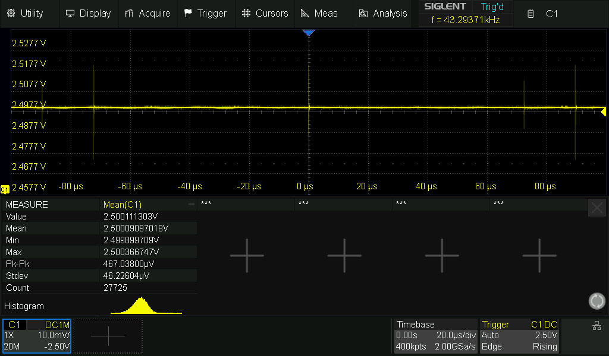

#  2.5V Precision Reference

A compact 2.5V precision voltage reference module, ideal for use as a standalone reference when building analog circuit prototypes or for verifying the accuracy of your multimeter’s voltage range over time.


## Prototyping and Testing
The design required a low voltage source to make the Reference module as compact as possible. A CR2032 coin cell at 3V is the ideal candidate.
This requirement turns into a design constrain as the minimum operating votage stated in the datasheet for the REF03 is 4.5V. The REF03 is a Low-Dropout
type Reference and is the best option to design a voltage reference due to its extremly low Temprature coefficient (10-50 ppm/C) and requires minimum passive
to operate.


### Charge pump
In order to generate a voltage that is sufficient to drive the REF03 above the minimum operating voltage a charge pump topology is implemented.
The charge pump consist of a variable frequency oscillator and a voltage doubler circuit. The oscillator is constructed using SN74 logic inverter with
hystersis and a RC feedback network. At 3V input the circuit can generate a maximum of 5.6V but drops drastically depending on the load.
The quiescent current of the REF03 is around 1 ma which also gives a bit of headroom to even sink some current into the DUT. 


Oscillator: SN74LVC2G14DBV sot23-6 soldered with passives on a proto pcb.

### Testing

Following tests are performed with a wide BW. You can see some High frequency noise along with the voltage ripples at the charge pump output (with REF03 connected). After Further testing it seems like the ripples are generated from the oscillator.
The SN74LVC2G14DBV has a fast rising edge about 4ns, this combined with schmitt trigger action and the board parasitic's results in a ringing behaviour at the output. This high frequency component seems to bypass even the REF03 and appears at the Reference Voltage. Implementation of an additional filtering circuit might be necessary. Another option is to find a Inverter with slower rise time.


Tested the Reference output with Co-ax to make sure the noise isn't form a background source. Other two channels are connected to charge pump output and the oscillator output.


- Yellow : Reference Output
- Pink :   Charge pump Output
- Blue :   Oscillator  Output


#### No Load condition


With a high impedance load like a multimeter (more like no load) attached to the output of REF03, the voltage is quite stable and exhibts minimal ripple.
The output voltage is around 5.47V with a ripple of 36.25mv Pk-Pk (7.54mv RMS). The setup also draws around 6mA which is quite big, Since the REF03 draws 1-2 mA, the additional current should be consumed by the oscillator. Not a good circuit to leave ON for long time, This will drain the CR2032 in a day or two. Make sure to turn off the module with the toggle switch after use to save it from going complete dead. 


#### 10mA Load 


## Output Stability



## PCB Layout


## Renders


---
## Dimensions


- PCB Diameter : 45mm
- Binding Post spacing : 19.05mm 
- Mounting Holes : 2.2mm


## Features

- Single Coin Cell Operation (CR2032).
- TRIM pot for fine adjustment of output voltage.
- 4mm BNC Terminal with 3/4" spacing.
- Adjustment Range 2.3V - 2.8V.
- Compact Design with M2 mounting holes and Toggle switch.

---

## Datasheet
Datasheet: [Precision 2.5 V, 5.0 V, and 10.0 V
Voltage References](https://www.analog.com/media/en/technical-documentation/data-sheets/ref01_02_03.pdf)

```plaintext
## Some Design Afterthought's

## 💡 Design Notes

- The REF03 datasheet specifies a minimum operating voltage of 4.5 V.
- However, during testing, the output remained stable down to 3 V with no load.
- If your application sinks significant current, ensure supply voltage remains well above the minimum — ideally with a low-voltage cutoff circuit.
- The current consumption is quite a bit High to be operating from a single cell. Needs further digging at the charge pump circuit.
- Also the toggle switch seems to be upside down.. D'oh!


```
