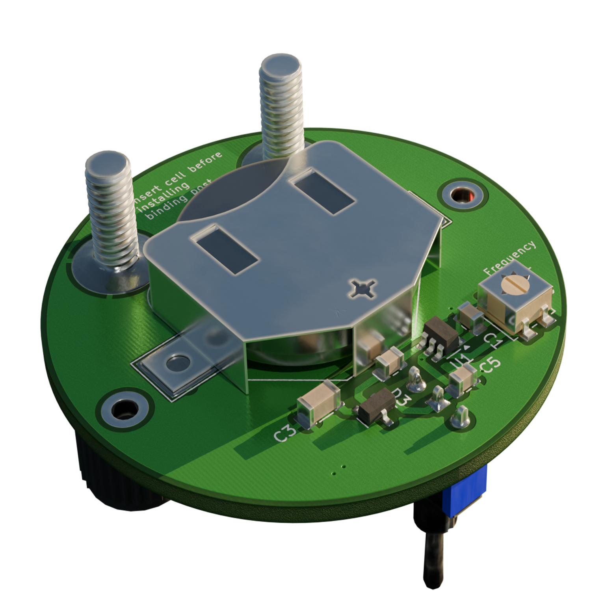

#  2.5V Precision Reference

A compact 2.5V precision voltage reference module, ideal for use as a standalone reference when building analog circuit prototypes or for verifying the accuracy of your multimeter’s voltage range over time.


## Prototyping and Testing
The design required a low voltage source to make the Reference module as compact as possible. A CR2032 coin cell at 3V is the ideal candidate.
This requirement turns into a design constraint as the minimum operating voltage stated in the datasheet for the REF03 is 4.5V. The REF03 is a Low-Dropout
type Reference and is the best option to design a voltage reference due to its extremly low Temperature coefficient (10-50 ppm/C) and requires minimum passive components to operate.


### Charge pump
In order to generate a voltage that is sufficient to drive the REF03 above the minimum operating voltage a charge pump topology is implemented.
The charge pump consists of a variable frequency oscillator and a voltage doubler circuit. The oscillator is constructed using an SN74 logic inverter with
hysteresis and an RC feedback network. At 3V input, the circuit can generate a maximum of 5.6V but drops drastically depending on the load.
The quiescent current of the REF03 is around 1 mA, which also gives a bit of headroom to even sink some current into the DUT. 


Oscillator: SN74LVC2G14DBV sot23-6 soldered with passives on a proto pcb.

### Testing

The following tests are performed with a wide bandwidth. You can see some high-frequency noise along with voltage ripples at the charge pump output (with REF03 connected). After further testing, it seems like the ripples are generated from the oscillator.
The SN74LVC2G14DBV has a fast rising edge of about 4ns; this, combined with Schmitt trigger action and the board's parasitics, results in a ringing behavior at the output. This high-frequency component seems to bypass even the REF03 and appears at the reference voltage. Implementation of an additional filtering circuit might be necessary. Another option is to find an inverter with a slower rise time.


Tested the reference output with coax to make sure the noise isn't from a background source. The other two channels are connected to the charge pump output and the oscillator output.


- Yellow : Reference Output
- Pink :   Charge pump Output
- Blue :   Oscillator  Output


#### No Load condition


The voltmeter isn't accurate and is used to observe voltage drops with and without load.


With a high-impedance load like a multimeter (essentially no load) attached to the output of the REF03, the voltage is quite stable and exhibits minimal ripple.
The output voltage is around 5.47V with a ripple of 36.25mV peak-to-peak (7.54mV RMS). The setup also draws around 6mA, which is quite high. Since the REF03 draws 1-2 mA, the additional current should be consumed by the oscillator. This is not a good circuit to leave ON for a long time; it will drain the CR2032 in a day or two. Make sure to turn off the module with the toggle switch after use to prevent it from going completely dead. 


#### 10mA Load 
The charge pump output voltage seems to drop significantly if the REF03 starts to sink current to the load. The REF03 is rated to sink up to 24mA, but this much current will render my simple charge pump setup useless. I did end up testing the current sink capability of the prototype using a variable potentiometer, and it seems like the voltage starts to drop around 16mA of total current draw. This indicates that the prototype PCB was able to sink 10mA from the REF03 (remember that the circuit draws 6mA at idle). The voltage dropping trend was observed using a 3.5-digit multimeter, and results may vary with more accurate meters.


While sinking 16mA of total current, the charge pump output drops to around 4.87 volts while also exhibiting some ripple characteristics. The ripple is around 300mV peak-to-peak with a frequency that corresponds to the charge pump switching frequency. Thankfully, the ripple doesn't reflect on the output of the REF03. Note that these ripples can be minimized with appropriate capacitance.

## Output Stability

Currently, I don't own a precision multimeter, which makes it harder to measure how stable the output voltage really is. What I do own is a DSO with a 12-bit ADC (SDS800X), and it seems to read the voltage accurately up to 4 digits easily. The high-frequency noise at the output seems a bit annoying and likely skews the results a bit.


Reference voltage with No filter(Coupling: DC , BW: 20MHz)

## Filtering
In the end, I attempted to filter out the high-frequency noise using a simple RC filter with a cutoff frequency of around 1.5 kHz to achieve a more stable result. I also substituted the resistor with a ferrite bead. Both methods worked well in attenuating the noise. Although the filter did not eliminate it entirely, the noise was attenuated by approximately 20 dB when using the ferrite bead.


Noise measurement with a Ferrite Bead Pi Filter (Coupling: AC , BW: 20MHz)


Reference voltage with Ferrite Bead and a 10uF capacitor filter(Coupling: DC , BW: 20MHz)

## PCB Layout
The following schematic and PCB are designed with KiCad 9.


## Renders
- Tools:
  - pcb2blender addon for KiCad
  - Blender




---
## Dimensions


- PCB Diameter: 45mm
- Binding Post Spacing: 19.05mm 
- Mounting Holes: 2.2mm


## PCB Features

- Single coin cell operation (CR2032).
- Trim pot for fine adjustment of output voltage.
- 4mm BNC terminal with 3/4" spacing.
- Adjustment range: 2.3V - 2.8V.
- Compact design with M2 mounting holes and toggle switch.

---

## Datasheet

Datasheet: [Precision 2.5V, 5.0V, and 10.0V Voltage References](https://www.analog.com/media/en/technical-documentation/data-sheets/ref01_02_03.pdf)

```plaintext

## Some Design Afterthought's

- The REF03 datasheet specifies a minimum operating voltage of 4.5 V.
- However, during testing, the output remained stable down to 3 V with no load.
- If your application sinks significant current, ensure the supply voltage remains well above the minimum — ideally with a low-voltage cutoff circuit.
- The current consumption is quite high for operating from a single cell. Needs further investigation of the charge pump circuit.
- Also, the toggle switch seems to be upside down... D'oh!


```
